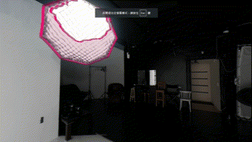

This is an experimental Three.js lab built on R3F. It enables hoverable objects in a panorama by leveraging segmentation results from Meta's Segment Anything Model (SAM): [GitHub Repository](https://github.com/facebookresearch/segment-anything).  

## Installation (Windows CMD)  
```bash
gh repo clone jrjuang/panorama-segments-r3f
cd panorama-segments-r3f
npm install
npm run dev
```

## Usage  
- **Mouse hover**: Highlight objects segmented in a panorama.
- **Click on a door**: Change the room.
- **Left button**: Drag to look around the scene. 
- **F2 Key**: Switch to each room in turn.
- **First-time** loading may be slow; please wait about 5 seconds.


